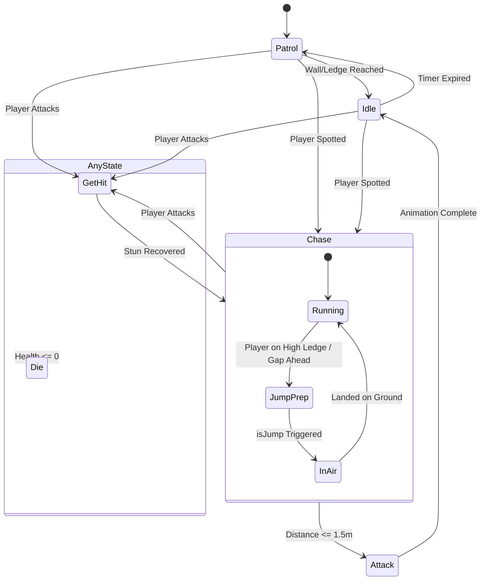
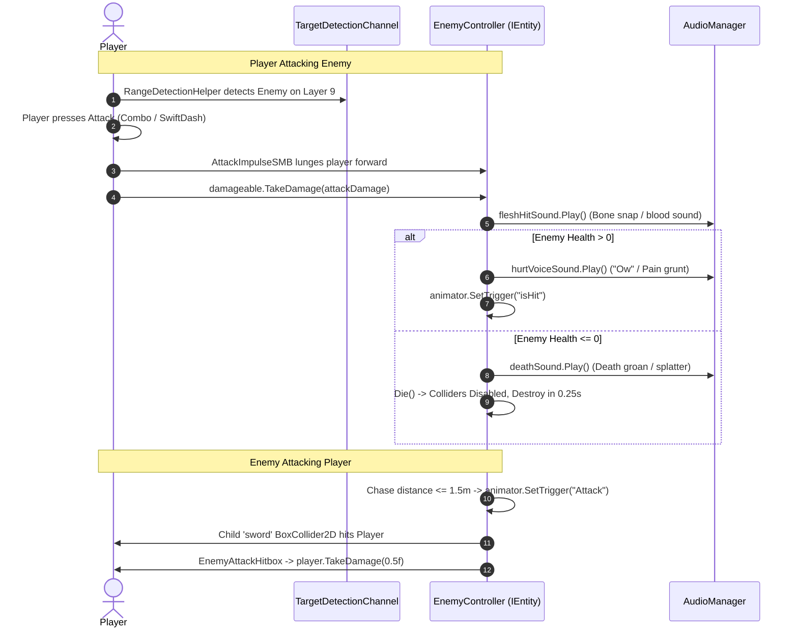

# 🥷 Enemy System Architecture & Deep Dive Guide: Ninja Enemy

Welcome to the comprehensive technical documentation for the enemy system in **Running-Out**. This guide covers every script, component, state machine behaviour, mathematical formula, visual raycast geometry, and the two-way interaction between the **Enemy** and the **Player**.

---

## 📑 Table of Contents
1. [High-Level Architectural Philosophy](#1-high-level-architectural-philosophy)
2. [Component Responsibility & Hierarchy Matrix](#2-component-responsibility--hierarchy-matrix)
3. [The Context Hub: `EnemyContext.cs`](#3-the-context-hub-enemycontextcs)
4. [Senses & Vision: `EnemyPerception.cs`](#4-senses--vision-enemyperceptioncs)
5. [Physics & Locomotion: `EnemyMovement.cs`](#5-physics--locomotion-enemymovementcs)
6. [Dynamic Jump Physics: `OnEdgeResponse.cs`](#6-dynamic-jump-physics-onedgeresponsecs)
7. [Health & Life Cycle: `EnemyController.cs`](#7-health--life-cycle-enemycontrollercs)
8. [Offense & Weaponry: `EnemyAttackHitbox.cs`](#8-offense--weaponry-enemyattackhitboxcs)
9. [State Machine Behaviours (SMBs) in Detail](#9-state-machine-behaviours-smbs-in-detail)
10. [Visual Flowcharts & Perception Raycast Geometry](#10-visual-flowcharts--perception-raycast-geometry)
11. [Two-Way Player ↔ Enemy Combat Interaction](#11-two-way-player--enemy-combat-interaction)
12. [Prefab Hierarchy & Inspector Configuration](#12-prefab-hierarchy--inspector-configuration)

---

## 1. High-Level Architectural Philosophy

The enemy AI is built using a **Decoupled Blackboard + State Machine Behaviour (SMB)** pattern:

```
┌─────────────────────────────────────────────────────────────┐
│                 Unity Animator Controller                   │
│         (Idle ⇄ Patrol ⇄ Chase ⇄ Jump ⇄ Attack ⇄ Die)        │
└───────────────┬─────────────────────────────┬───────────────┘
                │                             │
    [Drives States via SMBs]      [Drives States via SMBs]
                │                             │
                ▼                             ▼
   ┌───────────────────────────┐ ┌───────────────────────────┐
   │    EnemyStateBehaviour    │ │     EnemyController       │
   │  (Base class for all SMBs)│ │  (Health, Audio, Entity)  │
   └─────────────┬─────────────┘ └─────────────┬─────────────┘
                 │                             │
                 └──────────────┬──────────────┘
                                ▼
                 ┌─────────────────────────────┐
                 │        EnemyContext         │
                 │   (The Shared Blackboard)   │
                 └──────────────┬──────────────┘
                                │
        ┌───────────────────────┼───────────────────────┐
        ▼                       ▼                       ▼
┌───────────────┐       ┌───────────────┐       ┌───────────────┐
│ EnemyMovement │       │EnemyPerception│       │OnEdgeResponse │
│  (Locomotion) │       │(Vision/Rays)  │       │(Jump Physics) │
└───────────────┘       └───────────────┘       └───────────────┘
```

### Why this design is effective:
1. **Zero Monolithic Spaghetti:** Instead of a single 2,000-line script running endless `switch` or `if/else` checks in `Update()`, each behavior (`PatrolSMB`, `ChaseSMB`, `JumpSMB`) is isolated in its own self-contained class.
2. **Animation-Driven State Timing:** Animations and logic are synchronized. When an attack animation ends or reaches a specific frame, the Animator transitions cleanly into the next state.
3. **The `EnemyContext` Blackboard:** All sub-components (`EnemyMovement`, `EnemyPerception`, `Rigidbody2D`, `LayerMasks`) are cached in a single serializable object. State machine scripts only need a reference to `Context`, eliminating repeated `GetComponent` calls during gameplay.

---

## 2. Component Responsibility & Hierarchy Matrix

| Script / Component | Attached To | Inherits From | Core Responsibility |
| :--- | :--- | :--- | :--- |
| **`EnemyController`** | Root (`Enemy Ninja`) | `MonoBehaviour`, `IEntity` | Manages HP, hit reactions, dying, audio triggers, and initializes `EnemyContext`. |
| **`EnemyContext`** | Serialized Class | Plain C# Object | Blackboard containing references to all components, layers, and the active `Target`. |
| **`EnemyMovement`** | Root (`Enemy Ninja`) | `MonoBehaviour` | Directly manipulates `Rigidbody2D.linearVelocity`, facing direction, horizontal moving, jumping, and flipping. |
| **`EnemyPerception`** | Root (`Enemy Ninja`) | `MonoBehaviour` | Executes all 2D raycasts: forward ledge detection, wall/obstacle detection, and player detection. |
| **`OnEdgeResponse`** | Root (`Enemy Ninja`) | `MonoBehaviour`, `IEdgeResponse` | Calculates required parabolic launch velocity to leap up or down onto player platforms. |
| **`EnemyAttackHitbox`** | Child (`sword`) | `MonoBehaviour` | Trigger volume that detects collisions with the player and calls `damageable.TakeDamage()`. |
| **`EnemyStateBehaviour`**| Animator States | `StateMachineBehaviour` | Base abstract class caching `EnemyController` and exposing `Context` to all SMB states. |

---

## 3. The Context Hub: `EnemyContext.cs`

`EnemyContext` is the communication bridge. It contains:

* **Component References:** `rb` (Rigidbody2D), `animator` (Animator), `perception` (EnemyPerception), `enemyMovement` (EnemyMovement), `spriteRenderer` (SpriteRenderer).
* **Layer Masks:**
  * `playerLayer`: Identifies the player collider for detection.
  * `groundLayer`: Identifies walkable platforms, ceilings, and walls.
  * `enemyLayer`: Identifies other enemies to prevent overlapping/clumping.
* **Interface Bridge:**
  * `edgeResponseBehaviour`: Points to `OnEdgeResponse` as an `IEdgeResponse` interface.
* **Dynamic State:**
  * `Target`: Stores the `Transform` of the player when detected.

```csharp
// How components access each other safely:
Context.enemyMovement.Move(speed);
Context.perception.HasGroundAhead();
Context.Target = playerTransform;
```

---

## 4. Senses & Vision: `EnemyPerception.cs`

`EnemyPerception` is the sensory organ of the enemy. It operates using specialized 2D physics queries:

### 1. Forward Ledge / Pit Detection (`HasGroundAhead()`)
* **Raycast:** Casts a ray downward from a point ahead of the enemy's feet:
  $$\text{Origin} = (x + \text{edgeCheckForwardOffset} \times \text{FacingDir},\; y - \text{edgeCheckDownOffset})$$
* **Purpose:** If this ray hits nothing, the enemy is standing at a cliff/ledge!

### 2. Wall & Higher Ground Detection (`HasWallOrHigherGroundAhead()`)
* **Raycast:** Casts forward horizontally along the ground level over `obstacleCheckDistance` (0.6 units).
* **Purpose:** Detects raised ledges or solid walls in front of the enemy.

### 3. Ally Enemy Detection (`HasOtherEnemyAhead()`)
* **Raycast:** Casts forward on the `enemyLayer`.
* **Purpose:** Prevents multiple enemies from walking directly inside each other during patrols.

### 4. Player Detection (`TryFindPlayer()`)
* **Physics Query:** `Physics2D.OverlapCircle(transform.position, detectionRadius, playerLayer)`
* **Detection Radius:** `10.51` units.
* **Result:** When the player steps within this circle, `currentTarget` is locked, and `animator.SetBool("PlayerSpotted", true)` fires.

### 5. Ceiling Detection (`HasCeilingAbove()`)
* **Raycast:** Casts vertically upward for 3.0 units.
* **Purpose:** In `ChaseSMB`, prevents jumping if there is a ceiling directly above that would cause the enemy to bonk their head.

### 6. Target Platform Query (`TryGetTargetPlatform()`)
* **Raycast:** Casts down from the player's position to identify the bounding box (`Bounds`) of the platform the player is standing on.

---

## 5. Physics & Locomotion: `EnemyMovement.cs`

`EnemyMovement` is the physical motor. It translates decisions from the state machine into Rigidbody2D velocity adjustments:

* **Facing Direction:** Determined by `transform.localScale.x`:
  $$\text{FacingDirection} = \begin{cases} 1 & \text{if } \text{localScale.x} > 0 \\ -1 & \text{if } \text{localScale.x} < 0 \end{cases}$$
* **`Move(float speed)`:** Sets horizontal velocity while preserving vertical velocity:
  $$\vec{v} = (\text{FacingDirection} \times \text{speed},\; v_y)$$
* **`Jump(float forwardSpeed, float jumpPower)`:** Overrides horizontal and vertical velocity simultaneously:
  $$\vec{v} = (\text{FacingDirection} \times \text{forwardSpeed},\; \text{jumpPower})$$
* **`StepBack(float force)`:** Reverses velocity to hop backward away from the player.
* **`Flip()`:** Negates `transform.localScale.x` to turn around cleanly.
* **`FaceTarget(Vector2 targetPos)`:** Compares `targetPos.x` to `transform.position.x` and flips if the enemy is looking in the wrong direction.
* **`IsGrounded()`:** Uses `Physics2D.OverlapBox` at the feet $(y - 0.5)$ against `groundLayer`.

---

## 6. Dynamic Jump Physics: `OnEdgeResponse.cs`

When chasing the player across platform gaps or up onto higher ledges, standard pathfinding isn't used. Instead, `OnEdgeResponse` calculates **ballistic kinematic jump velocities**:

### The Physics Formula:
To reach a height difference $\Delta y$, the required takeoff velocity $v_y$ under gravity $g$ is:
$$v_y = \sqrt{2 \cdot g \cdot h}$$

```
                Higher Platform ───────┐ (Player is here)
                                       │
                ▲                      │
               / \                     │ Δy + Clearance
              /   \                    │
             /     \                   │
Enemy ──────┘                          ▼
```

### Jump Scenarios in `HandleChaseEdge()`:
1. **Player is Higher ($\Delta y > +0.3\text{m}$):**
   * Jump height $h = \Delta y + \text{highJumpHeightClearance}$ (2.0m clearance).
   * Calculates $v_y = \sqrt{2g \cdot h}$, clamped with `highJumpForce` (12.0).
   * Sets forward speed to `highJumpForwardSpeed` (3.2m/s).
2. **Player is Lower ($\Delta y < -0.5\text{m}$):**
   * Small drop-down hop ($h = 0.4\text{m}$).
   * Forward speed = $\text{chaseSpeed} \times 0.8$.
3. **Same Height / Gap Across ($\Delta y \approx 0$):**
   * Standard gap jump ($h = 1.5\text{m}$).
   * Forward speed = Full `chaseSpeed`.

---

## 7. Health & Life Cycle: `EnemyController.cs`

`EnemyController` handles vital statistics and death:

* **Interface Implementation:** Implements `IEntity.TakeDamage(float amount)`.
* **Health Pool:** `maxHealth = 70f`.
* **Audio Integration:**
  * `fleshHitSound`: Triggers `EnemyHurt.asset` on every hit (bone break / blood shed).
  * `deathSound`: Triggers `EnemyDied.asset` when lethal damage is received.
  * `hurtVoiceSound`: Voice/grunt reaction when surviving.
* **Death Routine:**
  ```csharp
  public void Die()
  {
      animator.SetBool("isDead", true);
      animator.Play("Die", 0, 0f);
  }
  ```

---

## 8. Offense & Weaponry: `EnemyAttackHitbox.cs`

Located on the child GameObject named **`sword`**:
* Has a `BoxCollider2D` set to `isTrigger = true`.
* Tagged with `Enemy`.
* When the attack animation swings the sword into the player:
  1. `OnTriggerEnter2D(Collider2D collision)` catches the overlap.
  2. Verifies `collision.GetComponent<IEntity>()` and `PlayerController`.
  3. Executes `damageable.TakeDamage(0.5f)`.

---

## 9. State Machine Behaviours (SMBs) in Detail

Every state in the Animator has an attached script derived from `EnemyStateBehaviour`:

### 1. `IdleSMB.cs`
* **Purpose:** Combat pause and situational awareness.
* **On Enter:** Stops movement velocity immediately.
* **On Update:** Checks for player via `TryFindPlayer`.
  * If distance $\le 1.3\text{m}$ and `attackCooldown` (1.0s) has elapsed: fires `Attack` trigger.
  * If distance $> 1.3\text{m}$: resets `isIdle = false` to transition into `chase`.

### 2. `PatrolSMB.cs`
* **Purpose:** Wandering back and forth along platforms.
* **On Update:**
  1. Scans for the player. If seen: sets `PlayerSpotted = true` $\rightarrow$ transitions to Chase.
  2. Checks `HasGroundAhead()` and `HasObstacleOrEnemyAhead()`.
  3. If at a ledge or wall: calls `Flip()` and sets a `turnCooldown` (0.25s).
  4. Moves forward at `patrolSpeed` (2.0m/s).

### 3. `ChaseSMB.cs`
* **Purpose:** High-speed pursuit with intelligent platform traversal.
* **Mechanics:**
  * **Ground Chase:** Runs at `chaseSpeed` (5.0m/s) facing the player.
  * **Higher Platform Calculation:** If player is $> 0.6\text{m}$ higher:
    * Retrieves the bounds of the player's platform.
    * Computes left takeoff $(min.x - 2.0)$ and right takeoff $(max.x + 2.0)$.
    * Navigates to the nearest takeoff point.
    * Checks for ceiling clearance.
    * Once in position, triggers `isJump`.
  * **Attack Trigger:** When distance $\le 1.5\text{m}$, stops movement and triggers `Attack`.

### 4. `AttackSMB.cs`
* **Purpose:** Executes the slash.
* **On Enter:** Freezes linear velocity so the enemy doesn't slide while attacking.
* **On Exit:** Sets `isIdle = true` to force a momentary recovery pause before the next action.

### 5. `JumpSMB.cs`
* **Purpose:** Executes the leap.
* **On Enter:** Calls `edge.HandleChaseEdge(target, 5f)` to launch with ballistic velocity. Sets a grace timer (0.2s) so the enemy leaves the ground before checking landing.
* **On Update:** Once falling ($v_y \le 0.1$) and `IsGrounded()` returns true (or air time exceeds 1.2s), transitions back to `chase`.

### 6. `GetHitSMB.cs` & `StunSMB.cs`
* **Purpose:** Flinch and stun reactions.
* **Behavior:** Halts all movement velocity while the hit animation plays.

### 7. `DieSMB.cs`
* **Purpose:** Clean death and ragdoll prevention.
* **On Enter:**
  1. Halts all velocity and changes `Rigidbody2D.bodyType` to `Kinematic`.
  2. Disables all `Collider2D`s on the enemy so the player can immediately dash through the corpse without collision.
  3. Calls `Destroy(animator.gameObject, 0.25f)` to clean up the entity.

---

## 10. Visual Flowcharts & Perception Raycast Geometry

### Enemy State Transition Flowchart



---

### Perception Raycast Geometry

```
                    [Ceiling Check Ray] (Up 3.0m)
                            ▲
                            │
                            │
               ┌────────────┴───────────┐
               │                        │
               │       Enemy Head       │
               │                        │
[Wall Check] ──┼─►                      ├─► [Obstacle / Enemy Ray] (Forward 0.6m)
(Height -0.1m) │       Enemy Body       │
               │                        │
               └────────────┬───────────┘
                            │
              Feet: (x + 0.3, y - 0.3)
                            │
                            ▼
               [Ledge Check Ray] (Down 0.3m)
               (Missing ground = Cliff!)
```

---

## 11. Two-Way Player ↔ Enemy Combat Interaction

The combat system is a closed loop between the Player's detection channels and the Enemy's collider setup:



---

## 12. Prefab Hierarchy & Inspector Configuration

Here is how the **`Enemy Ninja.prefab`** is built in the Unity Inspector:

```
Enemy Ninja (Root GameObject)
├── Layer: 9 (Enemy)
├── Tag: "Enemy"
├── Components:
│   ├── Transform (Scale: X=-1 or +1 determines facing)
│   ├── SpriteRenderer (Ninja character visual)
│   ├── BoxCollider2D (Main physics hit box, Size: 1 x 1)
│   ├── Rigidbody2D (Dynamic, Mass: 1, Constraints: Freeze Rotation Z)
│   ├── Animator (Controller: ninja.controller)
│   ├── EnemyController (maxHealth: 70, links to sounds)
│   ├── EnemyMovement (Handles speed, velocity, flipping)
│   ├── EnemyPerception (detectionRadius: 10.51, groundLayer: 6, playerLayer: 3)
│   └── OnEdgeResponse (highJumpForce: 12, clearance: 2, dropJump: 0.4)
│
├── sword (Child GameObject)
│   ├── Tag: "Enemy"
│   ├── Transform (Positioned in front of hands)
│   ├── BoxCollider2D (isTrigger: TRUE)
│   └── EnemyAttackHitbox (damage: 0.5)
│
└── EnemySprite (Child GameObject)
    └── SpriteRenderer (Secondary animation layer / effects)
```

---

### Summary of Component Interdependence:
* If you move the enemy, **`EnemyMovement`** applies the force to **`Rigidbody2D`**.
* If the enemy looks around, **`EnemyPerception`** checks **`groundLayer`** and **`playerLayer`**.
* If the enemy jumps between ledges, **`OnEdgeResponse`** calculates gravity and velocity, then feeds it into **`EnemyMovement.Jump()`**.
* If the player attacks, **`PlayerCombat`** reads the enemy's **`IEntity`** interface through **`EnemyController`**, triggering our sound system and animations simultaneously.
